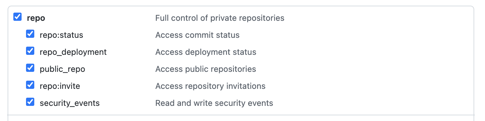

# Github Action Cleaner
CLI command to clean your old build history in github actions in batch.

## Installation

```
$ npm install -g github-action-cleaner
```

## Usage
```
$ github-action-cleaner -h
usage: github-action-cleaner [-h] [-v] [-o OWNER] [-r REPO] [-t GITHUB_TOKEN]

Example: github-action-cleaner -o hex0cter -r github-action-cleaner -t ghp_zfkK**********1f3DBrm3

optional arguments:
  -h, --help            show this help message and exit
  -v, --version         show program's version number and exit
  -o OWNER, --owner OWNER
                        Owner of repo
  -r REPO, --repo REPO  Repo name
  -t GITHUB_TOKEN, --github-token GITHUB_TOKEN
                        Github token from https://github.com/settings/tokens/new?scopes=repo
```

The github token can be created [here](https://github.com/settings/tokens/new?scopes=repo) and needs the following permissions:


